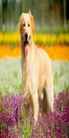
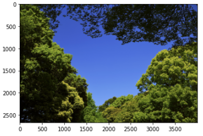

# F12. 파이썬으로 이미지 파일 다루기

학습 목표

- 컴퓨터에서 이미지가 표현되는 방식을 이해한다.
- 이미지 파일을 Pillow와 OpenCV로 다룬다.
- CIFAR-100에서 히스토그램을 기반으로 유사한 이미지를 골라낸다.

화면은 수 많은 점들로 이루어져 있고 그 점을 화소라고 부른다. 화소는 RGB 3개의 색 강도를 통해 색상을 표현한다.

> 그런데 왜 RGB 3개일까?

인간의 시각에서 색상을 담당하는 원뿔세포가 세 종류(적색, 녹색, 청색)이며, 각각 R, G, B에 가까운 파장을 흡수하기 때문이라고 한다.([나무위키](https://namu.wiki/w/RGB))

보통 한 점마다 각 색상별로 8비트를 사용하여 0~255 사이의 값으로 해당 색의 감도를 표시한다.

RGB는 색을 표현하는 방식이다. RGB뿐만 아니라 상황에 따라 적절한 색을 표현하는 방식(컬러 스페이스)들이 있다. 

- YUV(TV에서 사용)
- HSV(색상을 직관적으로 표현)
- CMYK(네가지 색상 표현)

이렇게 다양한 컬러 스페이스들이 있는데 이 방식들로 이미지를 그대로 저장하면 많은 용량을 차지한다. 그래서 다양한 이미지 압축 방식들이 나왔는데 그 중 가장 대표적인 것이 JPG와 PNG이다.

- JPG : 근처 화소들을 묶어, 비슷한 색들을 뭉뚱 그리는 방식으로 이미지를 압축한다.
- PNG : 색상을 미리 정의해두고 사용해서 색상의 손실이 없다.
- GIF : 이미지 내에 여러 프레임을 두어 이를 움직일 수 있게 만들었다. PNG 처럼 색상의 손실이 없다.

> 이미지는 결국 배열 형태의 데이터다.

가로, 세로 각 32픽셀에 RGB 3개의 색상 채널이라면 Numpy로 (32, 32, 3) 차원을 배열을 나타낸다.

### Pillow와 OpenCV

---

개발중단 된 PIL(Python Image Library)을 Pillow가 이어받아 지속적으로 개발해오고 있다.

```python
import numpy as np
from PIL import Image

data = np.zeros([32, 32, 3], dtype=np.uint8)
image = Image.fromarray(data, 'RGB')
image
```


```python
data[:, :] = [255, 0, 0]
image = Image.fromarray(data, 'RGB')
image
```


‼️ `data[:, :] = [255 ,0, 0]` 은  (32, 32,3) 형태인 data를 (3,) 형태의 데이터로 broadcast 되어 대입되었다. 이에대해 조금 더 토의해보았는데 (32, 32, 3) 행렬에 대해 브로드캐스팅이 가능한 경우는 3가지가 있다.

- (32, 32, 3) + 상수
- (32, 32, 3) + (3,)
- (32, 32, 3) + (32, 3)

‼️ 또 `data = [255, 0, 0]` 과 `data[:] = [255, 0, 0]` 이 다른것은 `data[:]`은 (32, 32, 3) 라는 배열을 크기를 지정해주기 때문이다. 그래서 브로드캐스팅이 된 것!!!

**Pillow로 이미지 다루기**

```python
from PIL import Image

img = Image.open('dog.jpg')
img # 이미지 열기

print(img.width)
print(img.height)

resized_image = img.resize((100,200))
resized_image.save(os.getenv('HOME')+'/aiffel/python_image_proc/data/resized_pillow_practice.png')
resized_image

croped_image = img.crop((200, 50, 400, 230))
croped_image.save('croped_image.jpg')
croped_image
```

img


resized_img



croped_img


**OpenCV로 이미지 다루기**

OpenCV에서는 색 채널의 순서가 RGB가 아니고 BGR이다. 필요에 따라 변환이 필요

```python
import os
import cv2 as cv
import numpy as np
from  matplotlib import pyplot as plt

img_path = 'sky.jpg'
# 이미지를 읽는다.
img = cv.imread(img_path)

# 색상 표현방식을 BGR에서 HSV로 바꾼다.
hsv_img = cv.cvtColor(img, cv.COLOR_BGR2HSV)

# HSV 색상표에서 blue를 나타내기 위함 lower_blue는 blue의 아래 기준, upper_bluw는 blug의 윗 기준, 즉 중간값들이 블루!
lower_blue = np.array([100,100,100])
upper_blue = np.array([130,255,255])

# hsv_img에서 lower_bluw와 upper_blue 사이 값에 해당되는 값을 255로 그렇지 않은 값을 0으로 매치한다.
mask = cv.inRange(hsv_img, lower_blue, upper_blue)

# 방금만든 mask로 bitwise_and 연산을 수행한다. 
res = cv.bitwise_and(img,img, mask= mask)

plt.imshow(cv.cvtColor(img, cv.COLOR_BGR2RGB))
plt.show()
plt.imshow(cv.cvtColor(mask, cv.COLOR_BGR2RGB))
plt.show()
plt.imshow(cv.cvtColor(res, cv.COLOR_BGR2RGB))
plt.show()
```

img



mask


res


**실습: 비슷한 이미지 찾아내기**

여기서 비슷한 이미지란 cifar100 이미지 50000장을 가지고 특정 이미지 1장과 모든 이미지 간의 Histogram의 차이가 가장 작은 5개를 찾는것이다.

이미지의 Histogram의 계산은 `cv2.calcHist` 라는 함수를 이용했다. [링크](https://opencv-python.readthedocs.io/en/latest/doc/19.imageHistograms/imageHistograms.html)

그리고 두 히스토그램 분포의 비교는 `cv2.compareHist` 를 이용했다. 비교 방법은 method에 따라 다르다고 하는데 [여기](https://wjddyd66.github.io/opencv/OpenCV(4)/)를 참고하기 바란다.

**느낀점**

---

Pillow와 OpenCv에 대한  노드였지만 개인적인 생각으론 파일을 다루는 법에 대해 배운 것 같다. 이미지 처리는 되게 간단했지만  `os`, `tqdm`, `sorted` 등을통해 파일을 다루는 것은 익숙치 않은 사람들에게 매우 어렵게 다가왔을 것 같다.