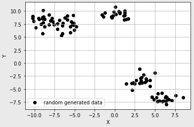
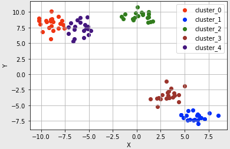
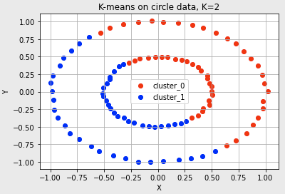
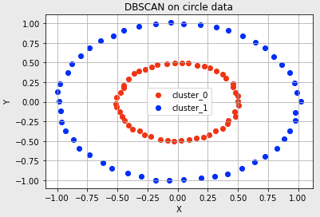
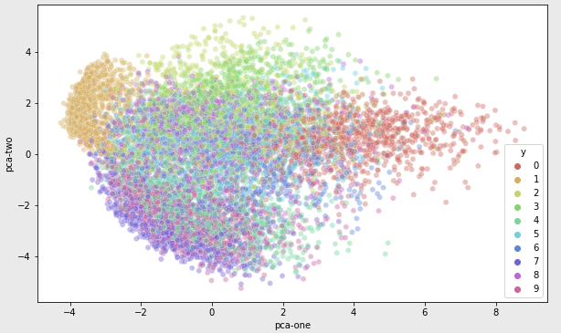
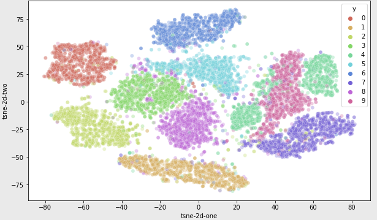

# F17. 비지도학습

목차

1. 비지도학습에 대하여
2. 클러스터링 (1) K-means
3. 클러스터링 (2) DBSCAN
4. 차원 축소 (1) PCA
5. 차원 축소 (2) T-SNE
6. 정리 및 요약


## 1. 비지도학습에 대하여

지도학습과 달리 training data로 정답(label)이 없는 데이터가 주어지는 학습방법을 말한다.

비지도학습은 주어진 데이터가 어떻게 구성되어 있는지 스스로 알아내는 방법

아무도 정답을 알려주지 않은 채 오로지 데이터셋의 특징 및 패턴을 기반으로 모델 스스로가 판단하는 것


지도학습의 대표적인 예인 **분류**에서 데이터들의 라벨을 메겨서 데이터셋을 마련해야 하는데 이때 적지 않은 인적자원이 필요하다. 이 문제를 해결하기 위해 라벨링 되어 있지 않은 데이터들 내에서 특징이나 패턴을 가진 데이터들끼리 군집화 한 뒤, 새로운 데이터가 어떤 군집에 속하는 지 추론하는 비지도 학습론이 제시되었다.

비지도학습의 대표적인 예 **군집화**


## 2. 클러스터링 (1) K-means

데이터 X가 무엇인지 정답 y가 없다. 또 y가 될 수 있는 카테고리도 없다.

군집화란 그렇게 명확한 분류 기준이 없는 상황에서도 데이터들을 분석하여 가까운 것들끼리 묶어주는 작업

K-means 알고리즘은 k값이 주어졌을 때 주어진 데이터들을 k개의 클러스터로 묶는 알고리즘


다음과 같은 점을 만들었다.



K-means를 이용한 분류



잘 수행한 것을 볼 수 있다.

하지만, 유클리드 거리가 가까운 데이터끼리 군집을 형성하기 때문에 결과가 다음과 같이 잘 나오지 않을 수 있다.




## 3. 클러스터링 (2) DBSCAN

Density Based Spatial Clustering of Applications with Noise : 밀도기반의 군집 알고리즘

K-means로 해결하기 어려웠던 문제들을 DBSCAN을 통해 해결할 수 있다.

이 알고리즘의 가장 큰 특징은 K-means 처럼 K값을 미리 지정할 필요가 없다는 것

유클리드 거리 기반이 아니고 조밀하게 몰려 있는 클러스터를 군집화 하기 때문에 불특정한 형태의 군집도 표현이 가능하다.


클러스터가 최초의 임의의 점 하나로부터 퍼져나간다. 그 기준이 바로 일정 반경 안의 데이터의 개수, 즉 데이터의 밀도이기 때문이다.


### 1. DBSCAN 알고리즘의 동작

**용어 정리**

- **epsilon** 클러스터의 반경
- **minPts** 클러스터를 이루는 개체의 최솟값
- **core point** 반경 epsilon 내에 minPts개 이상의 점이 존재하는 중심점
- **border point** 군집의 중심이 되지는 못하지만, 군집에 속하는 점
- **noise point** 군집에 포함되지 못하는 점

DBSCAN에서는 **epsilon**, **minPts**값을 미리 지정해줘야 한다.


**동작순서**

1. 임의의 점 p 설정, p의 주위 반경(epsilon) 안에 포함되어 있는 점의 갯수를 센다
2. 반경에 minPts개 이상의 점이 있다면 p를 core point로 간주하고 반경의 점들을 클러스터로 묶는다.
3. minPts개 미만의 점이있다면 건너뛰기
4. 모든점에 대하여 1~3번 과정 반복, 새로운 점 p가 기존의 클러스터에 속한다면 하나의 클러스터로 묶는다.
5. 모든 점에 대한 클러스터링 과정이 끝났는데 클러스터에 속하지 않는 점은 Noise point, 군집에 속하지만 core point가 아닌 점을 border point


K-means로 해결할 수 없었던 문제 DBSCAN로 해결



적절한 `epsilon`값과 `minPts` 값이 필요함

단점

- K-means와 비교했을 때 데이터가 커지면 소요시간이 급격하게 증가함
- 데이터 분포에 맞는 `epsilon`, `minPts` 값 설정이 필요함


## 4. 차원축소 (1) PCA

차원축소는 수많은 정보 속에서 우리에게 더 중요한 요소가 무엇인지 알게 해주는 방법

비지도학습에서 데이터를 나타내는 여러 특징 중 어떤 특징이 가장 그 데이터를 잘 표현하는지 알게 해주는 특징 추출이 중요하다.


PCA는 데이터 분포의 주성분을 찾아주는 방법이다. 주성분의 의미는 데이터의 분산이 가장 큰 방향벡터를 의미한다.

데이터의 분산을 최대로 보존하면서, 서로 직교하는 기저벡터들을 찾아 고차원 공간을 저차원으로 투영한다.

기존 feature 중 중요한 것은 선택하는 것이 아닌 기존의 feature를 선형결합하는 방식


기저벡터를 변경하면 차원을 줄이면서 데이터의 분산은 유지할 수 있다. -> 차원축소

위의 이미지에서는 분산이 긴 축을 첫기저로 잡고 그 기저에 직교하는 축을 다음 기저로 잡는다.


위 그림에서 원본 데이터의 특징을 잘 살리면서 차원을 1개 줄인 것은 X-Y이다. 이는 Z축 방향의 정보는 상대적으로 덜 중요하다. -> 수학적으로 Z 방향의 분산이 적다고 표현할 수 있다.


PCA는 분산이 가장 길게 나오는 기저벡터를 찾아서 그 방향의 기저를 남기는 과정을 거친다. 이렇게 찾은 가장 중요한 기저를 주성분 방향 혹은, pc축 이라고한다.


PCA를 통한 유방암 데이터 분석 결과 `PCA(n_components=2)`

```
PCA 분석을 사용한 Test dataset accuracy: 54명/57명 => 0.947
PCA를 적용하지 않은 Test dataset accuracy: 43명/57명 => 0.754
```


## 5. 차원 축소 (2) T-SNE

T-Stochastic Neighbor Embedding `시각화에 많이 쓰이는 알고리즘`


PCA로 다 할 수 있는 것이 아니라, 1. 차원축소를 하는 목적에 따라  2. 어떤 정보를 보존할 것이냐에 따라 적합한 알고리즘이 따로 있다.

PCA는 주로 선형데이터의 분포가 있을 때 정보가 가장 잘 보존된다.

> 당연한 이야기겠지만 보존이라는 개념이 중요하네


시각화하여 데이터를 이해하기위한 차원 축소의 개념으로는 PCA를 하면 적절치 못하는 경우가 많다.


**T-SNE**는 기존의 차원의 공간에서 가까운 점들은, 차원축소된 공간에서도 여전히 가깝게 유지하도록 한다.

**PCA**가 데이터가 가진 고유한 물리적 정보량을 보존하는 데 주력이라면 **T-SNE**는 고유한 물리적 정보량보다는 데이터간의 상대적인 거리를 보존하는데 주력한다.


PCA를 이용한 MNIST 차원축소




T-SNE를 이용한 MNIST 차원축소




**T-SNE**에서는 먼 거리의 두 점은 저차원에서도 먼 거리에 있어야 한다.


하지만 T-SNE의 두 차원은 물리적 의미를 가지지 않는다. PCA는 정보 손실을 최소화 하려는 관점을 가지고 있으므로, 추출된 PC축은 주성분이라는 물리적 의미를 유지하고 있다. 공분산(?)을 통해 원본 데이터를 일정부분 복구도 할 수 있다. 하지만 T-SNE는 정보 손실량에 주목하지 않으므로, 저차원 축이 아무런 물리적 의미를 가지지 못한다. 오직 **시각화**에 유리하다.


## 정리

**K-means**

- 장점
  - 군집의 수 K가 주어졌을 때 유킬리드 거리기반으로 빠르게 군집화 수행
  - 알고리즘이 단순해 이해하기 쉬움
- 단점
  - 초기 중심점에 따라 결과가 달라짐
  - 전체 거리 평균값에 영향을 주어 outlier에 민감함

**DBSCAN**

- 장점
  - 밀도 기반의 군집화, outlier에 강함
  - K-mean처럼 K값 설정할 필요 없음
- 단점
  - 시간이 오래걸림
  - epsilon, minPts 초기 변수값 존재

**PCA**

- 장점
  - 데이터의 분포 분산을 유지한 채로 feature 차원을 줄임
  - 분산이 가장 길게 나오는 기저벡터(1)와 직교벡터(2)를 찾아서 나타내기 때문에 정확하고 간결하게 표현가능
  - feature수가 줄어 연산 속도가 빨라짐
- 단점
  - 최대분산방향이 feature의 구분을 좋게한다는 보장이 없음

**T-SNE**

- 장점
  - 차원 축소 전후 데이터의 상대적 거리가 유지되므로 시각화에 유리
- 단점
  - 차원 축소시 물리적 의미를 무시하므로 시각화 이외의 용도로 사용 어려움


